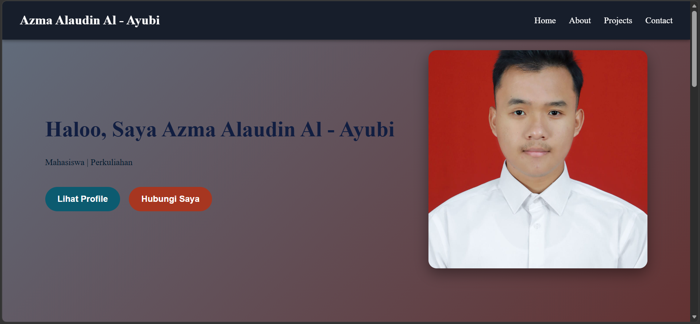
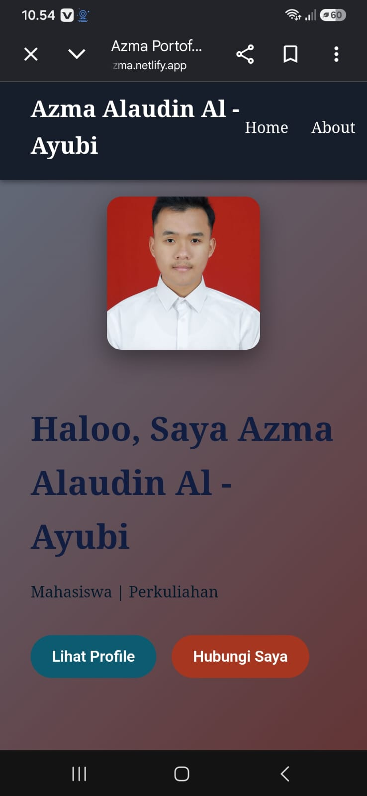

# Azma Portofolio

Selamat datang di website portofolio saya.

Website ini dibuat untuk memperkenalkan diri, menampilkan informasi tentang saya, serta menampilkan beberapa project yang telah saya kerjakan selama proses pembelajaran di bidang Teknologi Informasi.

## Live Demo
Lihat tampilan live website: https://portofolio-azma.netlify.app/

## Tentang Saya

Halo, saya **Azma Alaudin Al-Ayubi**, mahasiswa Teknologi Informasi di Universitas Jember.

Saya memiliki ketertarikan pada dunia teknologi, khususnya dalam pengembangan website, pemrograman, sistem basis data, dan pengembangan aplikasi.

Melalui website portofolio ini, saya ingin menampilkan beberapa project yang telah saya kerjakan sekaligus mendokumentasikan proses belajar dan pengalaman saya di bidang teknologi.

## Preview Website

### Desktop

  

### Mobile

  

## Fitur Website

Website portofolio ini memiliki beberapa bagian utama:

- **Home** — Halaman utama untuk memperkenalkan diri.
- **About** — Berisi informasi singkat mengenai diri saya.
- **Projects** — Menampilkan project yang telah saya kerjakan.
- **Contact** — Berisi informasi untuk menghubungi saya.

## Project

Beberapa project yang ditampilkan dalam portofolio ini antara lain:

### 1. Sistem Monitoring Data Pupuk Tani
Project yang dibuat untuk membantu proses pengelolaan dan monitoring data pupuk di bidang pertanian.

### 2. Sistem Monitoring Data Pupuk Tani — Sistem Basis Data
Project yang berfokus pada pengelolaan data menggunakan sistem basis data untuk membantu penyimpanan dan pengolahan informasi secara terstruktur.

### 3. Sistem Jual Beli dan Servis Alat Pertanian
Aplikasi yang dirancang untuk membantu proses jual beli dan servis alat pertanian. Project ini dibuat menggunakan konsep **Pemrograman Berorientasi Objek (PBO)**.

## Teknologi yang Digunakan

- HTML
- CSS
- JavaScript DOM
- Visual Studio Code
- Git & GitHub

## Tujuan

Website ini dibuat sebagai media untuk:

- Memperkenalkan diri.
- Menampilkan hasil project.
- Mendokumentasikan proses pembelajaran.
- Membangun portofolio di bidang Teknologi Informasi.
